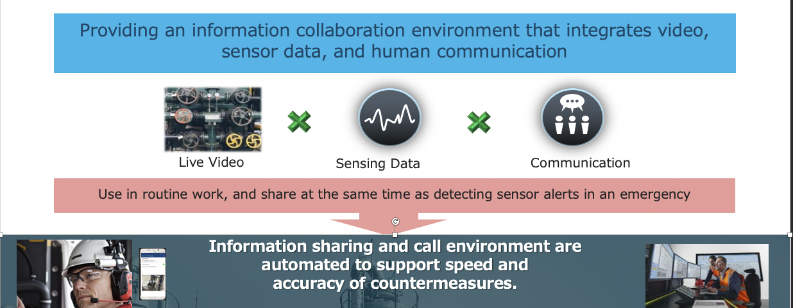
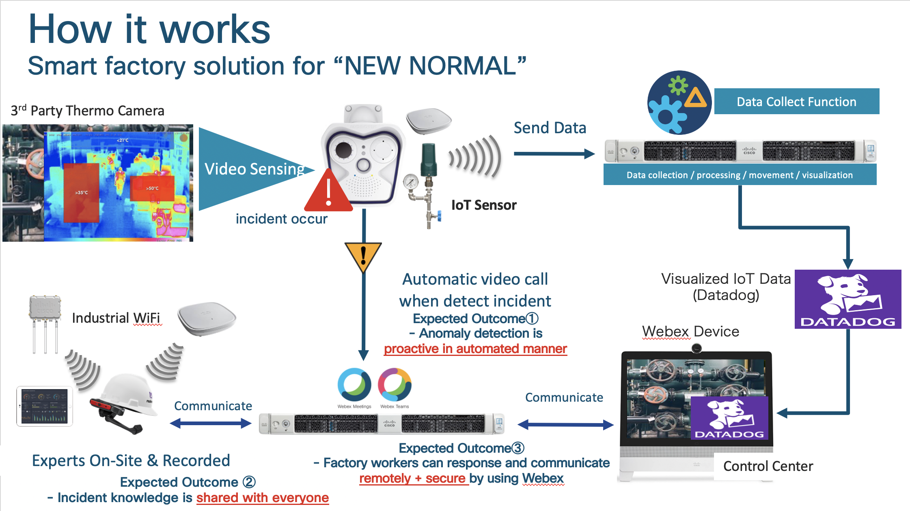
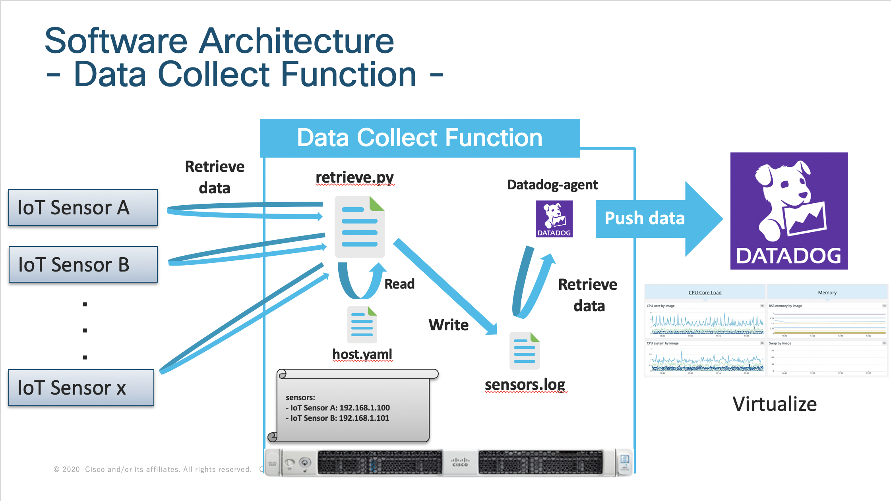

# TEAM SO GOOD
The value of this solution is to provide flexible integrated functionality for variety of end devices, IoT sensor alert, camera etc. with industrial worker’s communication.




How our solution works.
The 3rd Party Thermo Camera detect the incident and run the automatic video call to Webex. In Control Center, there have Webex Devices, so they can see the site situation remotely, and also call is broadcast to On-site factory worker which use wearable device to go to the incident place to fix the problem.
Webex Call to the Video Device and the Control Center and the worker recognize the incident situation by video and share the data which is collected IoT Sensor, to identify the incident




The Data Collect Function, which is explained in the below, periodically retrieve data from IoT Sensor and push data to Datadog, the integrated data platform.



## Getting Start

### Requirement
- python: 3.8.5
- python library
  - requests
  - pyyaml

## Configuration
If you want to add the sensors you want to monitor, add them to hosts.yaml.

```
sensors:
- <sensor name>: <ip address>
```

## Usage
```
git clone https://github.com/yukamoja/team-so-good
cd team-so-good
python retrieve.py
```

# License
BSD licensesis freely redistributable under the BSD 2 clause license. Use of this source code is governed by a BSD-style license that can be found in the LICENSE file.